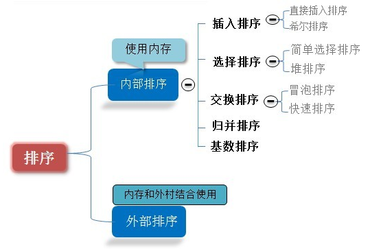

#### go 语言实现八大排序算法
排序有内部排序和外部排序，内部排序是数据记录在内存中进行排序，而外部排序是因排序的数据很大，一次不能容纳全部的排序记录，在排序过程中需要访问外存。

我们这里说说八大排序就是内部排序。

###### 1. 冒泡排序（BubbleSort)
冒泡排序的基本概念：
> 依次比较相邻的两个数，将小数放在前面，大数放在后面。即在第一趟：首先比较第1个和第2个数，将小数放前，大数放后。然后比较第2个数和第3个数，将小数放前，大数放后，如此继续，直至比较最后两个数，将小数放前，大数放后。至此第一趟结束，将最大的数放到了最后。在第二趟：仍从第一对数开始比较（因为可能由于第2个数和第3个数的交换，使得第1个数不再小于第2个数），将小数放前，大数放后，一直比较到倒数第二个数（倒数第一的位置上已经是最大的），第二趟结束，在倒数第二的位置上得到一个新的最大数（其实在整个数列中是第二大的数）。如此下去，重复以上过程，直至最终完成排序。由于在排序过程中总是小数往前放，大数往后放，相当于气泡往上升，所以称作冒泡排序。

实现：
> 外循环变量设为i，内循环变量设为j。假如有10个数需要进行排序，则外循环重复9次，内循环依次重复9，8，...，1次。每次进行比较的两个元素都是与内循环j有关的，它们可以分别用a[j]和a[j+1]标识，i的值依次为1,2,...,9，对于每一个i,j的值依次为1,2,...10-i。

图示：

-----
未完待续.....................................
太忙了
