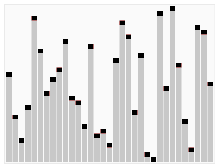
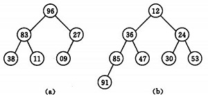
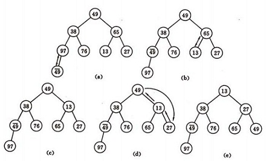

## 八大排序算法
排序算法可以分为内部排序和外部排序，内部排序是数据记录在内存中进行排序，而外部排序是因排序的数据很大，一次不能容纳全部的排序记录，在排序过程中需要访问外存。

常见的内部排序算法有：插入排序、希尔排序、选择排序、冒泡排序、归并排序、快速排序、堆排序、基数排序等。
我们这里说说八大排序就是内部排序。

### 1. 插入排序

插入排序是一种最简单直观的排序算法，它的工作原理是通过构建有序序列，对于未排序数据，在已排序序列中从后向前扫描，找到相应位置并插入。

##### 算法步骤：

1. 将第一待排序序列第一个元素看做一个有序序列，把第二个元素到最后一个元素当成是未排序序列。
2. 从头到尾依次扫描未排序序列，将扫描到的每个元素插入有序序列的适当位置。(如果待插入的元素与有序序列中的某个元素相等，则将待插入元素插入到相等元素的后面。)

### 2. 希尔排序

希尔排序，也称递减增量排序算法，是插入排序的一种更高效的改进版本。但希尔排序是非稳定排序算法。 
希尔排序是基于插入排序的以下性质而提出改进方法的：
>  插入排序在对几乎已经排好序的数据操作时， 效率高， 即可以达到线性排序的效率,但插入排序一般来说是低效的， 因为插入排序每次只能将数据移动一位

希尔排序的基本思想是：先将整个待排序的记录序列分割成为若干子序列分别进行直接插入排序，待整个序列中的记录“基本有序”时，再对全体记录进行依次直接插入排序。

##### 算法步骤：
1. 选择一个增量序列t1，t2，…，tk，其中ti>tj，tk=1;
2. 按增量序列个数k，对序列进行k 趟排序;
3. 每趟排序，根据对应的增量ti，将待排序列分割成若干长度为m的子序列，分别对各子表进行直接插入排序。仅增量因子为1 时，整个序列作为一个表来处理，表长度即为整个序列的长度。

### 3. 选择排序

##### 算法步骤：
1. 首先在未排序序列中找到最小(大)元素，存放到排序序列的起始位置
2. 再从剩余未排序元素中继续寻找最小(大)元素，然后放到已排序序列的末尾。
3. 重复第二步，直到所有元素均排序完毕。

### 4. 冒泡排序

冒泡排序(Bubble Sort)是一种简单直观的排序算法。它重复地走访过要排序的数列，一次比较两个元素，如果他们的顺序错误就把他们交换过来。走访数列的工作是重复地进行直到没有再需要交换，也就是说该数列已经排序完成。这个算法的名字由来是因为越小的元素会经由交换慢慢“浮”到数列的顶端。

##### 算法步骤：
1. 比较相邻的元素。如果第一个比第二个大，就交换他们两个。
2. 对每一对相邻元素作同样的工作，从开始第一对到结尾的最后一对。这步做完后，最后的元素会是最大的数。
3. 针对所有的元素重复以上的步骤，除了最后一个。
4. 持续每次对越来越少的元素重复上面的步骤，直到没有任何一对数字需要比较。

### 5. 归并排序

归并排序(Merge sort)是建立在归并操作上的一种有效的排序算法。该算法是采用分治法(Divide and Conquer)的一个非常典型的应用。

##### 算法步骤：
1. 申请空间，使其大小为两个已经排序序列之和，该空间用来存放合并后的序列
2. 设定两个指针，最初位置分别为两个已经排序序列的起始位置
3. 比较两个指针所指向的元素，选择相对小的元素放入到合并空间，并移动指针到下一位置
4. 重复步骤3直到某一指针达到序列尾
5. 将另一序列剩下的所有元素直接复制到合并序列尾

### 6. 快速排序

快速排序是由东尼·霍尔所发展的一种排序算法。在平均状况下，排序 n 个项目要Ο(n log n)次比较。在最坏状况下则需要Ο(n2)次比较，但这种状况并不常见。事实上，快速排序通常明显比其他Ο(n log n) 算法更快，因为它的内部循环(inner loop)可以在大部分的架构上很有效率地被实现出来。快速排序使用分治法(Divide and conquer)策略来把一个序列(list)分为两个子序列(sub-lists)。

##### 算法步骤：
1. 从数列中挑出一个元素，称为 “基准”(pivot)，
2. 重新排序数列，所有元素比基准值小的摆放在基准前面，所有元素比基准值大的摆在基准的后面(相同的数可以到任一边)。在这个分区退出之后，该基准就处于数列的中间位置。这个称为分区(partition)操作。
3. 递归地(recursive)把小于基准值元素的子数列和大于基准值元素的子数列排序。
递归的最底部情形，是数列的大小是零或一，也就是都已经被排序好了。虽然一直递归下去，但是这个算法总会退出，因为在每次的迭代(iteration)中，它至少会把一个元素摆到它最后的位置去。

### 7. 堆排序

堆排序(Heapsort)是指利用堆这种数据结构所设计的一种排序算法。堆积是一个近似完全二叉树的结构，并同时满足堆积的性质：即子结点的键值或索引总是小于(或者大于)它的父节点。
堆排序的平均时间复杂度为Ο(nlogn) 。

##### 基本思想：
堆的定义如下：具有n个元素的序列（k1,k2,...,kn),当且仅当满足:  
  
时称之为堆。由堆的定义可以看出，堆顶元素（即第一个元素）必为最小项（小顶堆）。
若以一维数组存储一个堆，则堆对应一棵完全二叉树，且所有非叶结点的值均不大于(或不小于)其子女的值，根结点（堆顶元素）的值是最小(或最大)的。如： 
 (a)  大顶堆序列：（96, 83,27,38,11,09)  
 (b)  小顶堆序列：（12，36，24，85，47，30，53，91） 
 

初始时把要排序的n个数的序列看作是一棵顺序存储的二叉树（一维数组存储二叉树），调整它们的存储序，使之成为一个堆，将堆顶元素输出，得到n 个元素中最小(或最大)的元素，这时堆的根节点的数最小（或者最大）。然后对前面(n-1)个元素重新调整使之成为堆，输出堆顶元素，得到n 个元素中次小(或次大)的元素。依此类推，直到只有两个节点的堆，并对它们作交换，最后得到有n个节点的有序序列。称这个过程为堆排序。

因此，实现堆排序需解决两个问题：
1. 如何将n 个待排序的数建成堆；
2. 输出堆顶元素后，怎样调整剩余n-1 个元素，使其成为一个新堆。

首先讨论第二个问题：输出堆顶元素后，对剩余n-1元素重新建成堆的调整过程。
调整小顶堆的方法：
1. 设有m 个元素的堆，输出堆顶元素后，剩下m-1 个元素。将堆底元素送入堆顶（（最后一个元素与堆顶进行交换），堆被破坏，其原因仅是根结点不满足堆的性质。
2. 将根结点与左、右子树中较小元素的进行交换。
3. 若与左子树交换：如果左子树堆被破坏，即左子树的根结点不满足堆的性质，则重复方法 （2）。
4. 若与右子树交换，如果右子树堆被破坏，即右子树的根结点不满足堆的性质。则重复方法 （2）。
5. 继续对不满足堆性质的子树进行上述交换操作，直到叶子结点，堆被建成。

称这个自根结点到叶子结点的调整过程为筛选。如图：

再讨论对n 个元素初始建堆的过程。
建堆方法：对初始序列建堆的过程，就是一个反复进行筛选的过程。
1. n 个结点的完全二叉树，则最后一个结点是第个结点的子树。
2. 筛选从第个结点为根的子树开始，该子树成为堆。
3. 之后向前依次对各结点为根的子树进行筛选，使之成为堆，直到根结点。

如图建堆初始过程：无序序列：（49，38，65，97，76，13，27，49）

未完待续.....................................
太忙了
